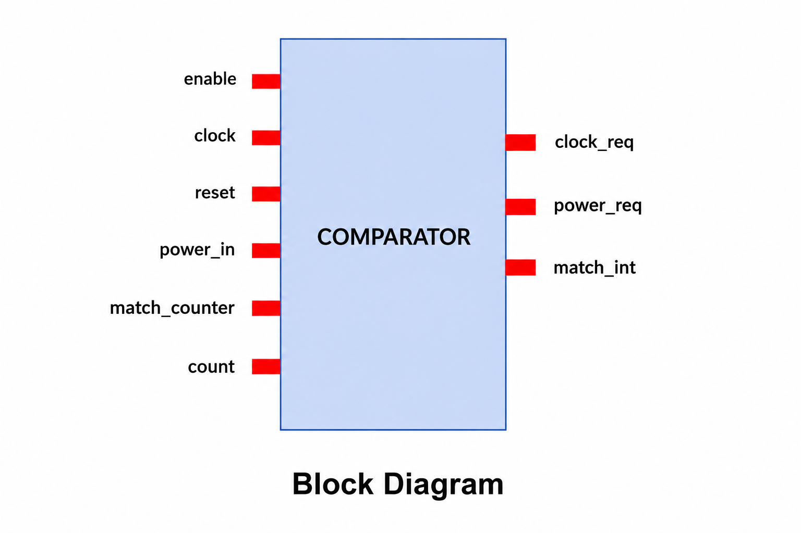
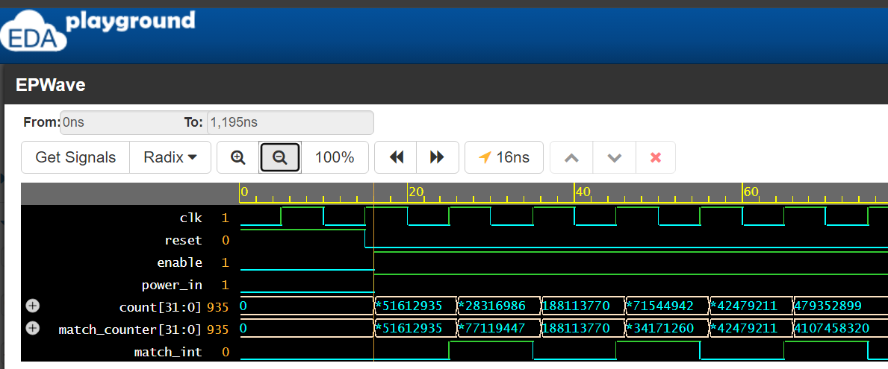
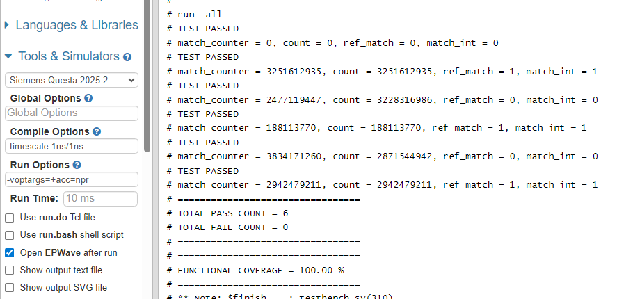
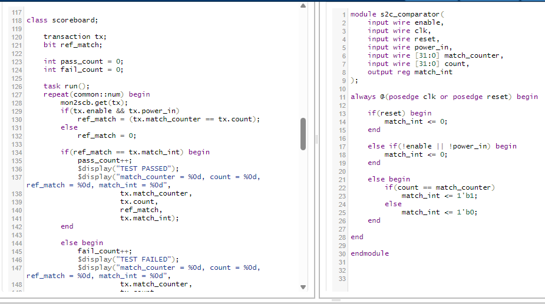

# 32-bit Comparator Verification using SystemVerilog

## Project Overview

This project implements and verifies a 32-bit Comparator with interrupt generation using Verilog and SystemVerilog.

The Comparator compares a 32-bit `count` value with a programmable `match_counter` value. When both values are equal, the module asserts the `match_int` signal.

A self-checking constrained-random verification environment was developed using mailbox-based communication, functional coverage, and scoreboard-based result checking.

The project was simulated using EDA Playground QuestaSim and analyzed in Vivado.

---

# Comparator Features

* 32-bit equality comparison
* Interrupt generation on successful match
* Enable-controlled operation
* Power-aware logic support
* Asynchronous reset handling
* Functional coverage implementation
* Scoreboard-based verification

---

# Verification Features

* Constrained-random transaction generation
* Self-checking scoreboard
* Functional coverage collection
* Reset verification
* Driver-Monitor architecture
* Mailbox-based communication
* Automated PASS/FAIL reporting
* Equality and mismatch verification
* Interrupt generation verification

---

# Verification Architecture

Generator → Driver → DUT(Comparator)
↓
Monitor
↓        ↓
Scoreboard    Coverage

## Verification Architecture

.png)

---

## Components

### Generator

Generates randomized comparator transactions.

### Driver

Drives randomized inputs to DUT using interface signals.

### Monitor

Captures DUT inputs and outputs.

### Scoreboard

Compares expected outputs with DUT outputs.

### Coverage

Tracks functional coverage of:

* enable conditions
* power conditions
* equality scenarios
* mismatch scenarios
* interrupt behavior

---

# Tools Used

* QuestaSim
* Vivado
* EDA Playground
* EPWave
* Cadence Xcelium

---

# Simulation Results

## Functional Verification Summary

* Total Testcases Passed: 6
* Total Failures: 0
* Functional Coverage: 100%

---

# Project Files

| File Name                                     | Description                           |
| --------------------------------------------- | ------------------------------------- |
| comparator.sv                                 | RTL Comparator Design                 |
| comparator_tb.sv                              | SystemVerilog Testbench               |
| Comparator_RTL_Verification_Specification.pdf | Project Specification Document        |
| Block_Diagram.png                             | Comparator Block Diagram              |
| Verification_Architecture.png                 | Verification Architecture Diagram     |
| Waveform_Output.png                           | Simulation Waveform Output            |
| Coverage_Output.png                           | Simulation Result and Coverage Output |
| RTL_Schematic.png                             | Vivado RTL Schematic                  |
| RTL_and_Scoreboard_Code.png                   | RTL and Scoreboard Code Screenshot    |

---

# Screenshots

## Block Diagram

## Verification Architecture

.png)

## Waveform Output

## Simulation and Coverage Output

## Vivado RTL Schematic

.png)

## RTL and Scoreboard Code

---

# Specification Document

[Comparator RTL Verification Specification](Comparator_RTL_Verification_Specification.pdf)

---

# Key Learnings

* RTL comparator design implementation
* Constrained-random verification methodology
* Functional coverage concepts
* Scoreboard-based verification
* Mailbox-based communication
* Interface and clocking block usage
* Reset handling in verification environments
* Waveform debugging and RTL analysis

---

# Applications

* Interrupt generation systems
* Timer systems
* Counter comparison logic
* FPGA digital systems
* ASIC subsystem verification
* Embedded digital controllers

---

# Author

Narasimhamurthy B
